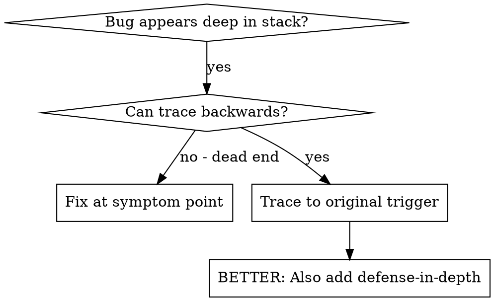
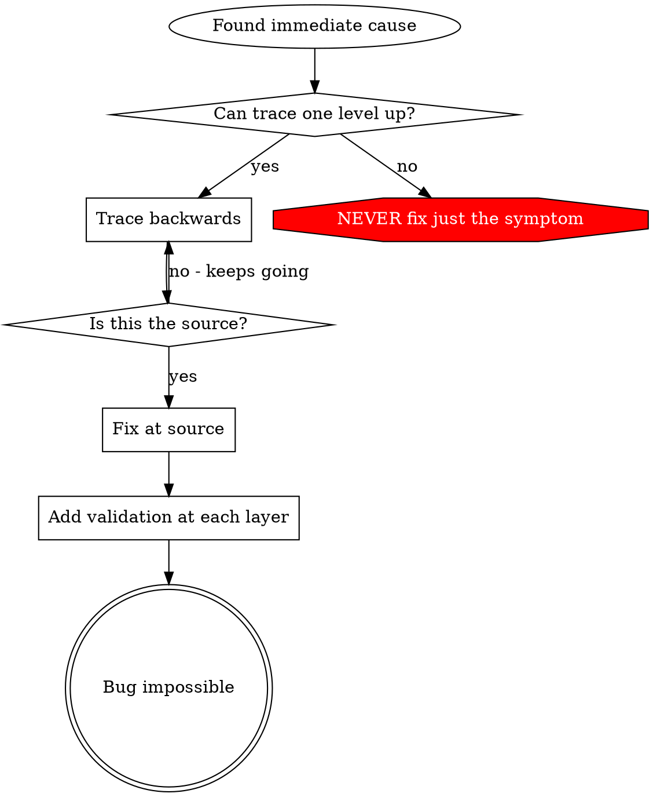

# Root Cause Tracing

## Overview

Bugs often manifest deep in the call stack (git init in wrong directory, file created in wrong location, database opened with wrong path). Your instinct is to fix where the error appears, but that's treating a symptom.

**Core principle:** Trace backward through the call chain until you find the original trigger, then fix at the source.

## When to Use

**Use when:**
- Error happens deep in execution (not at entry point)
- Stack trace shows long call chain
- Unclear where invalid data originated
- Need to find which test/code triggers the problem

## The Tracing Process

### 1. Observe the Symptom

Write the error, the file, and the line. Do not skip past it.

### 2. Find Immediate Cause

What code directly produces the error? Name the function and the argument it used.

### 3. Ask: What Called This?

Walk one caller up. Write the call chain as you go.

### 4. Keep Tracing Up

What value was passed? Where was it set? An empty string, a default, or a value read too early is a source, not a symptom.

### 5. Find Original Trigger

Stop at the first place the bad value is created. Fix that place.

## Adding Stack Traces

When you can't trace manually, log `new Error().stack` and the inputs before the operation. Use `console.error()` in tests so the log is not swallowed. Then read the stack for the test file, the line, and the bad value.

## Key Principle

**NEVER fix just where the error appears.** Trace back to find the original trigger.

## Stack Trace Tips

**In tests:** Use `console.error()` not logger - logger may be suppressed
**Before operation:** Log before the dangerous operation, not after it fails
**Include context:** Directory, cwd, environment variables, timestamps
**Capture stack:** `new Error().stack` shows complete call chain
